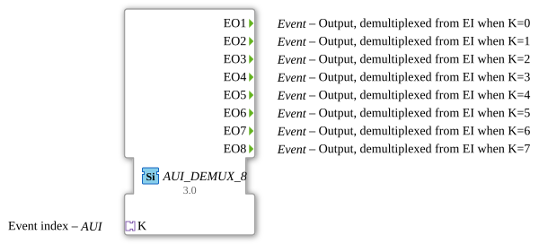

# AUI_DEMUX_8

* * * * * * * * * *
## Introduction

The **AUI_DEMUX_8** is an event demultiplexer function block that routes an incoming event to one of eight possible output channels. Unlike a conventional E_DEMUX block, which requires a separate event input and a data input for the selection index, this block receives both the event trigger and the index value through a single unidirectional AUI adapter socket. This design simplifies wiring in distributed control applications by consolidating the event and its routing information into one adapter connection.

The block is implemented as a generic function block (GEN_E_DEMUX), allowing it to be parameterized and reused across different application contexts while maintaining a consistent demultiplexing behavior.

## Interface Structure

### **Event Inputs**

This function block has **no explicit event inputs**. The incoming event is received via the AUI adapter socket, which combines the event trigger and the routing index into a single connection.

### **Event Outputs**

| Name  | Type  | Comment                                |
|-------|-------|----------------------------------------|
| EO1   | Event | Output, demultiplexed when K = 0       |
| EO2   | Event | Output, demultiplexed when K = 1       |
| EO3   | Event | Output, demultiplexed when K = 2       |
| EO4   | Event | Output, demultiplexed when K = 3       |
| EO5   | Event | Output, demultiplexed when K = 4       |
| EO6   | Event | Output, demultiplexed when K = 5       |
| EO7   | Event | Output, demultiplexed when K = 6       |
| EO8   | Event | Output, demultiplexed when K = 7       |

Each event output corresponds to one index value carried by the adapter, allowing the upstream event to be selectively forwarded to exactly one of the eight connected downstream blocks.

### **Data Inputs**

This function block has **no data inputs**. The selection index is transmitted as part of the AUI adapter data, rather than through a standalone data port.

### **Data Outputs**

This function block has **no data outputs**.

### **Adapters**

| Name | Type                                            | Direction | Comment      |
|------|-------------------------------------------------|-----------|--------------|
| K    | adapter::types::unidirectional::AUI             | Socket    | Event index  |

The **K** socket is a unidirectional AUI adapter that provides the event trigger together with the index value (0–7). Because it is a socket, the block expects a matching plug from the partner component, typically an event source or a bus controller that supplies both the event and its destination index.

## Functionality

The AUI_DEMUX_8 operates as a classic 1-to-N event demultiplexer, where N = 8. When the upstream component sends an event through the AUI adapter, the block extracts the accompanying index value and forwards the event to the corresponding output channel:

- If the index equals **0**, the event is emitted on **EO1**.
- If the index equals **1**, the event is emitted on **EO2**.
- ......
- If the index equals **7**, the event is emitted on **EO8**.

The demultiplexing decision is made solely from the index value carried by the adapter. The block requires no additional configuration parameters and does not retain state between events, making it a purely combinational routing element.

Because the block is a generic FB (GEN_E_DEMUX), the underlying implementation can be instantiated with different output counts or adapter variants depending on the application requirements, while the AUI_DEMUX_8 representation is fixed to eight outputs.

## Technical Features

- **Eight output channels**: Supports routing to one of eight independent event destinations.
- **Adapter-based input**: The event and index are combined in a single unidirectional AUI adapter, reducing the number of connections and simplifying the interface.
- **Generic implementation**: The block is built on the GEN_E_DEMUX generic FB pattern, making it suitable for code generation and toolchain integration.
- **No internal state**: The routing decision is stateless, so the block does not require initialization or reset sequences.
- **Direct index mapping**: No ambiguity in routing — each index value has a dedicated output, and out-of-range indices are not generated by the upstream contract.

## State Overview

The AUI_DEMUX_8 is a **stateless** function block. It does not contain an ECC (Execution Control Chart) state machine or maintain persistent internal variables. Every incoming event is processed independently:

1. An event arrives on the adapter K.
2. The index value is evaluated.
3. The corresponding output is triggered.
4. The block returns to its idle condition, ready for the next event.

This stateless behavior guarantees predictable and immediate response times, which is critical in time-sensitive control loops.

## Application Scenarios

The AUI_DEMUX_8 is well suited for scenarios where a single event source must selectively activate one of several processing paths based on a routing index. Typical use cases include:

- **Multi-machine coordination**: Distributing a start command to one of eight machines or substations based on a machine identifier.
- **Mode-based routing**: Selecting one of eight operating modes, where the mode index determines which downstream FB receives the event.
- **Reconfigurable communication hubs**: Acting as a flexible event router in IEC 61499 distributed applications, especially when the index source is also an adapter-based block.
- **Reducing wiring complexity**: Replacing separate event and data connections with a single adapter link, which is particularly beneficial in modular or hot-pluggable systems.

## Comparison with Similar Blocks

| Feature                               | E_DEMUX (standard)         | AUI_DEMUX_8                |
|---------------------------------------|----------------------------|----------------------------|
| Event input                           | Separate EI port           | Provided via AUI adapter   |
| Selection index input                 | Separate K data port       | Carried by AUI adapter     |
| Number of outputs                     | Typically 2–8 (configurable) | Fixed to 8               |
| Adapter-based connectivity            | No                         | Yes (unidirectional AUI)   |
| Genericity                            | Often generic              | Generic (GEN_E_DEMUX)      |
| Wiring complexity                     | Higher (two connections)   | Reduced (one connection)   |

Compared to the traditional E_DEMUX, the AUI_DEMUX_8 provides a more compact interface by merging the event trigger and the routing index into one adapter. However, it requires both the source and sink to support the AUI adapter protocol, so it is most effective in systems already built around adapter-based communication.

## Conclusion

The AUI_DEMUX_8 is a compact and efficient event demultiplexer that leverages a unidirectional AUI adapter to combine event triggering with index-based routing. Its eight outputs provide sufficient granularity for many industrial control and automation scenarios, while the stateless, generic implementation ensures reliable and predictable behavior. By reducing interface complexity and improving connection clarity, it is a valuable building block in modern IEC 61499-based distributed control systems.