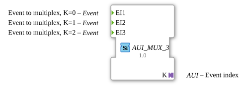

# AUI_MUX_3

* * * * * * * * * *

## Introduction

The AUI_MUX_3 is an event multiplexer function block designed for selecting and forwarding one of three incoming event signals based on an index provided through an AUI (Adapter Unit Interface) adapter. Unlike conventional multiplexers that use separate event output and index data inputs, this block integrates the selector and output channel into a single unidirectional AUI adapter. This design reduces the number of interface elements and simplifies the connection to downstream components that expect a standardized adapter-based event interface.

As a generic function block (based on the GEN_E_MUX template), it can be instantiated with different numbers of inputs or adapted to various use cases, but the provided configuration supports exactly three event inputs (EI1, EI2, EI3). The block is particularly useful in event-driven systems where multiple sources need to be routed to a common destination, with the selection logic controlled by an external entity via the AUI adapter.

## Interface Structure

### **Event Inputs**

| Name | Type | Comment |
|------|------|---------|
| EI1  | Event | Event to multiplex, K=0 |
| EI2  | Event | Event to multiplex, K=1 |
| EI3  | Event | Event to multiplex, K=2 |

These three event inputs represent the sources to be multiplexed. Only one of them is passed through to the output, depending on the value of the index provided through the AUI adapter.

### **Event Outputs**

There are no explicit event outputs in this block. The selected event is transmitted via the AUI adapter connection, which acts as the output channel. This is a deliberate design choice to integrate the output event and the selection logic in a single adapter interface.

### **Data Inputs**

There are no data inputs in this block. The multiplexer index is not provided as a separate data input but is instead carried within the AUI adapter connection.

### **Data Outputs**

There are no data outputs in this block.

### **Adapters**

| Name | Type | Direction | Comment |
|------|------|-----------|---------|
| K    | adapter::types::unidirectional::AUI | Output (Plug) | Event index and output channel |

The adapter `K` is a **plug** (output adapter) of type `adapter::types::unidirectional::AUI` (Adapter Unit Interface). It provides two functions:

- **Output for the selected event**: The multiplexed event is sent through this adapter to a connected socket.
- **Selector input**: The index value (0, 1, or 2) is supplied from the connected socket, indicating which of the three event inputs should be forwarded.

The AUI adapter encapsulates the index and the event output in a single connection, simplifying the wiring between the multiplexer and the receiving function block.

## Functionality

The AUI_MUX_3 operates as a three-input event router. Whenever an event occurs on any of its inputs (EI1, EI2, EI3), the block checks the current value of the index available on the AUI adapter. Only if the index matches the input number (i.e., EI1 with index 0, EI2 with index 1, EI3 with index 2) will the event be forwarded through the AUI adapter to the connected downstream block. Events arriving on non-selected inputs are ignored.

The index value is continuously monitored and can be updated at any time via the AUI adapter. This allows dynamic switching between sources without needing to preconfigure the selection externally. The block does not have internal states; it simply reacts to incoming events based on the current index.

In a typical scenario, the AUI adapter is connected to a socket of another function block that both provides the selection index (e.g., from a controller) and receives the multiplexed event. This creates a bidirectional (or unidirectional, depending on the adapter definition) communication channel where the upstream block supplies the selection, and the downstream block receives the event.

## Technical Features

- **Generic Implementation**: The block is based on the `GEN_E_MUX` generic template, allowing instantiation with different numbers of event inputs if needed, though the default configuration is fixed to three inputs.
- **AUI Adapter Integration**: Minimizes the number of separate interface points by combining the output event and the selector index into a single adapter connection. This reduces wiring complexity and improves modularity.
- **Unidirectional Adapter**: The `AUI` adapter is defined as unidirectional, meaning data and events flow only in one direction (from the multiplexer to the connected block). The index value is supplied externally to the adapter’s socket and is read by the multiplexer.
- **No Internal State**: The block is stateless and reacts purely to input events and the current index value. This makes it suitable for time-critical applications where deterministic behavior is required.
- **Event Prioritization**: In case multiple events occur simultaneously, the block does not prioritize them; the first event processed according to the runtime order will be evaluated. This is consistent with the behavior of standard event multiplexers.

## State Overview

This function block does not maintain any internal state. It has no state diagram because it does not store information between executions. The behavior is purely combinatorial:

- **Idle**: No event is present on any input.
- **Event Reception**: When an event arrives on one of the inputs, the block evaluates the current index from the AUI adapter.
- **Forwarding**: If the index matches the arriving input, the event is emitted through the adapter. Otherwise, the event is discarded.

The block is always ready to process the next event, and there is no transition delay except for the propagation of the adapter’s index value (which may change independently).

## Application Scenarios

- **Selective Event Routing**: In a system where multiple sensors or components generate events but only one should be processed at a time, AUI_MUX_3 can direct events from the currently active source to a central processing unit.
- **Configurable Input Selection**: When a control unit needs to switch between different data sources (e.g., different operating modes), the AUI adapter can be used to set the selection index dynamically, allowing the multiplexer to forward the appropriate event stream.
- **Adapter-Based Architectures**: In 4diac applications that heavily use adapters for decoupling and reusability, this block integrates seamlessly into a chain of adapters, avoiding the need for separate event and data lines.
- **Test and Simulation**: The block can be used in test harnesses to inject events from different input channels into a single output line, controlled by a test script that updates the adapter index.

## Comparison with Similar Blocks

The AUI_MUX_3 is a variant of the standard `E_MUX` event multiplexer. The key differences are:

- **Interface Structure**: `E_MUX` typically has separate event output (EO) and a data input (K) of type INT to specify the active input. AUI_MUX_3 instead uses an AUI adapter that combines the index and the output event into one connection.
- **Flexibility**: The `E_MUX` may allow configuration of the number of inputs via a generic parameter, while AUI_MUX_3 is fixed to three inputs in this version, but can be extended following the same pattern.
- **Integration**: AUI_MUX_3 is more suited for adapter-based designs where the output is expected to be an adapter socket. It reduces the number of connections and can simplify the visual layout of the application.
- **Standard-Tool Compatibility**: While `E_MUX` is a well-known block in many IEC 61499 implementations, AUI_MUX_3 is a specialized adaptation that may be used in environments where adapter-based event communication is preferred.

Other multiplexers like `E_MUX2` or `E_MUX4` share the same concept but differ in input count. AUI_MUX_3 is unique in that it encapsulates the selector channel into an adapter, which is not typical in standard libraries.

## Conclusion

AUI_MUX_3 provides a compact and elegant solution for event multiplexing in IEC 61499 applications that leverage adapter-based communication. By integrating the selection index and the output event into a single AUI adapter, it reduces interface clutter and promotes a cleaner system structure. Its stateless, event-driven nature ensures predictable behavior and easy integration into existing event processing chains. While it may not replace the standard `E_MUX` in all scenarios, it offers a valuable alternative for modern, adapter-centric designs. The block is a clear demonstration of how generic event processing can be adapted to meet the needs of evolving industrial automation architectures.
