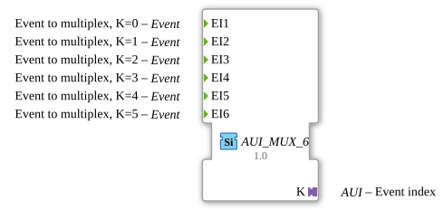

# AUI_MUX_6

* * * * * * * * * *

## Introduction

`AUI_MUX_6` is an event multiplexer function block with six event inputs. Instead of exposing a separate event output and a plain `K` data connection, it uses a unidirectional AUI adapter as its output interface. This combines the delivered event and the associated event index in a single adapter connection.

The block is a concrete configuration of the generic event multiplexer `GEN_E_MUX` and is intended for applications where multiple event sources must be merged into one unidirectional adapter-based event channel while preserving the identity of the triggering event source.

## Interface Structure

The block provides six event inputs and one AUI adapter plug. It has no conventional event outputs, data inputs, or data outputs.

### **Event Inputs**

| Name | Type | Comment |
|------|------|---------|
| `EI1` | Event | Event to multiplex, K=0 |
| `EI2` | Event | Event to multiplex, K=1 |
| `EI3` | Event | Event to multiplex, K=2 |
| `EI4` | Event | Event to multiplex, K=3 |
| `EI5` | Event | Event to multiplex, K=4 |
| `EI6` | Event | Event to multiplex, K=5 |

### **Event Outputs

None. The output event is carried through the AUI adapter `K`.

### **Data Inputs**

None.

### **Data Outputs**

None.

### **Adapters**

| Name | Type | Direction | Comment |
|------|------|-----------|---------|
| `K` | `adapter::types::unidirectional::AUI` | Plug | Event index |

The adapter `K` bundles the outgoing event with the corresponding event index. The index is zero-based and identifies which event input caused the output event.

## Functionality

`AUI_MUX_6` monitors its six event inputs and forwards a triggering event through the AUI adapter output. The event index carried by the adapter is derived from the input that was activated:

- An event on `EI1` produces an adapter event with index `0`.
- An event on `EI2` produces an adapter event with index `1`.
- An event on `EI3` produces an adapter event with index `2`.
- An event on `EI4` produces an adapter event with index `3`.
- An event on `EI5` produces an adapter event with index `4`.
- An event on `EI6` produces an adapter event with index `5`.

The adapter output is therefore both the multiplexed event signal and the source-identification signal. The receiving FB, connected through an AUI socket, can use the event to trigger its logic and the `K` value to determine which of the six original event inputs originated the event.

## Technical Features

- Six fixed event input channels with zero-based indices.
- Single unidirectional AUI adapter output `K`.
- Compact interface: replaces separate event output and data output connections with one adapter.
- No external data inputs are required for multiplexing.
- The `K` value is delivered together with the output event, guaranteeing that the event and its index are observed consistently.
- Uses the generic implementation class `GEN_E_MUX`, allowing tooling and runtime environments to treat it as a generic event multiplexer.

## State Overview

`AUI_MUX_6` does not define a persistent internal state machine. It behaves statelessly from the application viewpoint: each event input is handled independently and immediately produces the corresponding adapter output event. After the event is emitted, the block returns to its idle condition and waits for the next input event.

There is no enabling, disabling, or selection state. All six event inputs are always ready to be forwarded.

## Application Scenarios

- **Event source aggregation**: Combine multiple event sources into one adapter-based connection while preserving the source index.
- **Modular subapplication communication**: Transport events from several components of a subapplication to a central coordinator through a single unidirectional adapter.
- **Reduction of interface wiring**: Replace separate event and data lines with one AUI adapter connection, simplifying the interface of reusable FBs.
- **Source identification**: Use the `K` value on the receiving side to distinguish which of the six event inputs triggered the received event.
- **Generic event multiplexing**: Use the `GEN_E_MUX` generic behavior to build similar multiplexer variants with different numbers of event inputs.

## Comparison with Similar Blocks

| Block / Variant | Output Approach | Typical Use |
|-----------------|-----------------|-------------|
| Classic `E_MUX` style | Separate event output and `K` connection | Standard event multiplexing with direct event and data wiring |
| `AUI_MUX_6` | Event and index bundled in a unidirectional AUI adapter | Adapter-based multiplexing with source identification |
| Event demultiplexer | One input event routed to one of several outputs | Opposite operation: distributing one event stream to multiple destinations |

The main advantage of `AUI_MUX_6` over classic multiplexing blocks is the use of a single adapter connection instead of physically separate event and data interfaces. This keeps the event and its index together and simplifies the interface of the containing function block or subapplication.

## Conclusion

`AUI_MUX_6` provides a clean, adapter-based solution for multiplexing six event inputs into one unidirectional event channel. By combining the output event with a zero-based event index in the `K` AUI adapter, it preserves source information while reducing interface complexity. It is especially useful in modular 4diac applications where adapter-based communication is preferred over individual event and data connections.