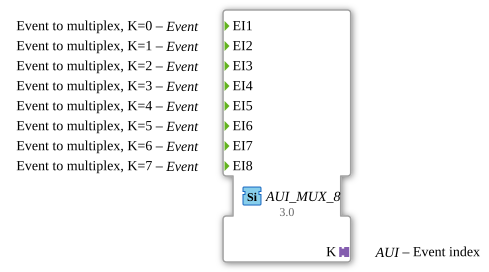

# AUI_MUX_8

* * * * * * * * * *
## Introduction

AUI_MUX_8 is an event multiplexer function block with a unidirectional AUI adapter output. It concentrates up to eight incoming event inputs on a single AUI adapter connection. Instead of forwarding the selected event through a plain event output and a separate index value, the block emits the event and the associated event index through the adapter `K`. It is a concrete specialization of the generic event multiplexer `GEN_E_MUX` and is intended for use in event-driven 4diac applications.

## Interface Structure

The FB has eight event inputs and one AUI adapter Plug. There are no conventional event outputs, data inputs, or data outputs. All outgoing event and index information is transported through the `K` adapter.

### **Event Inputs**

| Input | Description |
|-------|-------------|
| EI1 | Event to multiplex, K = 0 |
| EI2 | Event to multiplex, K = 1 |
| EI3 | Event to multiplex, K = 2 |
| EI4 | Event to multiplex, K = 3 |
| EI5 | Event to multiplex, K = 4 |
| EI6 | Event to multiplex, K = 5 |
| EI7 | Event to multiplex, K = 6 |
| EI8 | Event to multiplex, K = 7 |

### **Event Outputs**

None. The multiplexed event is sent through the AUI adapter `K`.

### **Data Inputs**

None.

### **Data Outputs**

None.

### **Adapters**

| Adapter | Type | Direction | Description |
|---------|------|-----------|-------------|
| K | `adapter::types::unidirectional::AUI` | Plug | Output adapter carrying the multiplexed event and the index of the active event input (0–7). |

## Functionality

When an event occurs at one of the event inputs, the FB produces an event on the `K` adapter. The index value attached to this adapter output corresponds to the triggered input:

- EI1 → K = 0  
- EI2 → K = 1  
- EI3 → K = 2  
- EI4 → K = 3  
- EI5 → K = 4  
- EI6 → K = 5  
- EI7 → K = 6  
- EI8 → K = 7  

The receiving FB on the other side of the AUI adapter can use the event to trigger processing and the index to identify the source. Because the index is determined by the event input and not by an external selector, the block can be used as a compact event-source encoder.

## Technical Features

- Supports up to eight event inputs with a fixed 0-based index mapping.
- Provides an AUI plug `K` using adapter type `adapter::types::unidirectional::AUI`.
- No separate event outputs or data pins; the AUI adapter encapsulates the output interface.
- Declared as a generic FB specialization with `GenericClassName = 'GEN_E_MUX'`.
- Stateless operation with no internal data persistence.
- Simplifies wiring by replacing explicit EO + K connections with an adapter-based connection.

## State Overview

The type description does not define an explicit ECC state machine. AUI_MUX_8 is a stateless, event-activated block. At runtime, it remains in its ready state until an event input occurs; then it immediately emits the event and index through `K` and returns to the ready state. No state information is stored between invocations.

## Application Scenarios

- Consolidating multiple event sources such as buttons, sensors, diagnostic flags, or mode triggers into one AUI-based connection to a central event handler.
- Supplying an event index to a processing block so the receiver can distinguish which source triggered the event.
- Reducing wiring complexity in 4diac applications by using AUI adapters instead of separate event output and index data connections.
- Serving as an eight-input specialization of a generic event multiplexer in modular automation logic.

## Comparison with Similar Blocks

- **Standard E_MUX:** Uses a plain event output and an external selector input. AUI_MUX_8 replaces this interface with an AUI adapter and derives the index directly from the triggering event input.
- **E_DEMUX:** Performs the inverse operation, routing one incoming event to one of several outputs according to a selector. AUI_MUX_8 merges several inputs into one adapter output.
- **Other AUI_MUX variants:** AUI_MUX_2, AUI_MUX_4, AUI_MUX_16, etc. follow the same principle with a different number of inputs and index range; AUI_MUX_8 is the eight-channel version.

## Conclusion

AUI_MUX_8 is a practical event multiplexing block for applications that use AUI adapter connections. It combines event concentration and source identification in one interface, allowing up to eight event inputs to be forwarded as a single adapter-based event with a clear index. Its stateless behavior and generic design make it suitable for modular, event-driven control systems based on 4diac.