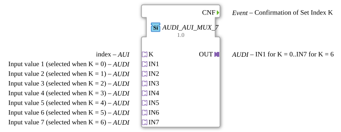

# AUDI_AUI_MUX_7

* * * * * * * * * *
## Introduction

The **AUDI_AUI_MUX_7** is a generic multiplexer function block designed for unidirectional adapter-based selection of analog data values. It accepts up to **seven input adapters** (IN1 through IN7) and routes one of them to a single output adapter (OUT) based on an index value provided via the K adapter. The block is implemented as a generic FB with the class name `GEN_AUDI_AUI_MUX`, allowing flexible reuse in various IEC 61499 applications.

A distinctive feature of this block is its **change-driven output behavior**: the output adapter is only refreshed when the selected value actually changes, and a confirmation event (CNF) is issued exclusively upon such a real modification. This minimizes unnecessary data traffic and event propagation in the system.

## Interface Structure

### **Event Inputs**

The block defines **no event inputs**. Activation and data flow are handled entirely through the adapter connections.

### **Event Outputs**

| Name | Type | Comment |
|------|------|---------|
| CNF | Event | Confirmation of Set Index K. Emitted when the output value has been updated due to an index change or a change in the selected input value. |

### **Data Inputs**

The block has **no direct data inputs**. All input data is transported through adapter sockets.

### **Data Outputs**

The block has **no direct data outputs**. All output data is transported through the adapter plug.

### **Adapters**

| Direction | Name | Type | Comment |
|-----------|------|------|---------|
| Plug (Output) | OUT | adapter::types::unidirectional::AUDI | Delivers the selected input value. |
| Socket | K | adapter::types::unidirectional::AUI | Provides the index selection (0 to 6). |
| Socket | IN1 | adapter::types::unidirectional::AUDI | Input value 1 (selected when K = 0). |
| Socket | IN2 | adapter::types::unidirectional::AUDI | Input value 2 (selected when K = 1). |
| Socket | IN3 | adapter::types::unidirectional::AUDI | Input value 3 (selected when K = 2). |
| Socket | IN4 | adapter::types::unidirectional::AUDI | Input value 4 (selected when K = 3). |
| Socket | IN5 | adapter::types::unidirectional::AUDI | Input value 5 (selected when K = 4). |
| Socket | IN6 | adapter::types::unidirectional::AUDI | Input value 6 (selected when K = 5). |
| Socket | IN7 | adapter::types::unidirectional::AUDI | Input value 7 (selected when K = 6). |

## Functionality

The AUDI_AUI_MUX_7 acts as a **7-to-1 multiplexer** operating on unidirectional adapter data. The index adapter **K** determines which of the seven input adapters (IN1…IN7) is forwarded to the output adapter **OUT**. The mapping is straightforward:

- K = 0 → OUT receives the value from IN1
- K = 1 → OUT receives the value from IN2
- ...
- K = 6 → OUT receives the value from IN7

The core logic of the block performs a continuous comparison between the last transmitted output value and the newly selected input value. If the selected value differs from the previously output value, the output adapter is updated and the **CNF** event is raised. If the value is identical to the last one, no update occurs and no event is triggered, regardless of whether the index changed or the input data was refreshed.

This behavior ensures that downstream components only react to genuine value changes, avoiding redundant processing and reducing communication overhead.

## Technical Features

- **Generic implementation** – The underlying generic FB (`GEN_AUDI_AUI_MUX`) can be instantiated for different adapter types or multiplexer widths by binding the appropriate adapter declarations.
- **Change detection** – Output update is suppressed when the selected value equals the last transmitted value; CNF is only emitted on actual modifications.
- **Unidirectional adapters** – All adapter interfaces are of the `unidirectional` type, making the block suitable for one-way data flow scenarios without handshake or acknowledgment logic at the adapter level.
- **Seven input channels** – Specifically tailored for applications requiring up to seven selectable data sources.
- **Index range** – The K adapter must provide a value in the range 0 to 6; values outside this range are not defined and should be avoided.
- **Event-based confirmation** – The CNF event provides a clear synchronization point for subsequent blocks or state machines.

## State Overview

The block does not expose an explicit state machine, but its internal behavior can be modeled as follows:

| State | Condition | Action |
|-------|-----------|--------|
| Idle | No index change and selected input value unchanged | No output update, no CNF emitted. |
| Update | Index changed **or** selected input value changed | New value written to OUT, CNF event raised. |

The block remains in the Idle state until one of the two trigger conditions occurs. After issuing CNF, it returns to Idle until the next change is detected.

## Application Scenarios

- **Sensor selection** – In agricultural or industrial machinery, the block can select between multiple analog sensors (e.g., temperature, pressure, fill level) based on a mode or channel selector.
- **Redundant measurement systems** – When several redundant sensors measure the same physical quantity, the mux can choose the active channel and only propagate the value when it actually differs from the last one.
- **Calibration and commissioning** – A service tool can switch between different test points or calibration inputs without generating unnecessary downstream events.
- **Multi-zone control** – In HVAC or process control, the block can route zone-specific values to a central controller, with event-driven updates only on real changes.

## Comparison with Similar Blocks

| Feature | AUDI_AUI_MUX_7 | Conventional Data MUX | Event-driven MUX |
|---------|----------------|-----------------------|------------------|
| Input channels | 7 (adapter-based) | Typically 2/4/8 (data pins) | Variable |
| Interface type | Unidirectional adapters | Direct data I/O | Direct data + event I/O |
| Output update | Only on value change | Always on selection | On request event |
| Confirmation event | CNF on actual change | None | REQ/CNF handshake |
| Generic capability | Yes (generic class) | No (fixed type) | Often fixed |

Compared to a conventional multiplexer, AUDI_AUI_MUX_7 adds intelligent change detection and adapter-based connectivity, making it more suitable for distributed, event-driven IEC 61499 systems. Unlike a simple event-triggered mux, it suppresses unnecessary output updates, which can significantly reduce network load in cyclic communication environments.

## Conclusion

The **AUDI_AUI_MUX_7** is a robust and efficient adapter-based multiplexer that combines the flexibility of a generic FB with a smart change-detection mechanism. Its unidirectional adapter interface, seven input channels, and event-driven confirmation make it an ideal building block for modern automation systems where data consistency and communication efficiency are critical. By emitting the CNF event only when the output value actually changes, it helps to keep downstream logic simple and to minimize unnecessary processing overhead.