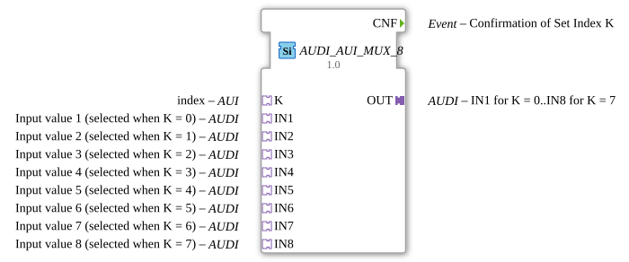

# AUDI_AUI_MUX_8

* * * * * * * * * *
## Introduction
The AUDI_AUI_MUX_8 is a generic multiplexer function block designed to select one of eight input adapters (IN1 to IN8) and forward its value to a single output adapter (OUT). The selection is controlled by a dedicated index adapter (K). This FB is implemented as a generic type (GEN_AUDI_AUI_MUX), allowing flexible adaptation across different data types. A key feature is that the output adapter is only updated when the actual value changes, and the confirmation event CNF is only triggered upon a genuine change.

## Interface Structure
### **Event Inputs**
None.

### **Event Outputs**
| Name | Type | Description |
|------|------|-------------|
| CNF | Event | Confirmation that the output has been updated with the selected input value. This event is only emitted when a value change actually occurred. |

### **Data Inputs**
None.

### **Data Outputs**
None.

### **Adapters**
| Direction | Name | Type | Description |
|-----------|------|------|-------------|
| Plug (Output) | OUT | adapter::types::unidirectional::AUDI | Selected input value is forwarded to this output adapter. |
| Socket (Input) | K | adapter::types::unidirectional::AUI | Index selection adapter. Determines which input (IN1..IN8) is routed to OUT. |
| Socket (Input) | IN1 | adapter::types::unidirectional::AUDI | Input value 1, selected when K = 0. |
| Socket (Input) | IN2 | adapter::types::unidirectional::AUDI | Input value 2, selected when K = 1. |
| Socket (Input) | IN3 | adapter::types::unidirectional::AUDI | Input value 3, selected when K = 2. |
| Socket (Input) | IN4 | adapter::types::unidirectional::AUDI | Input value 4, selected when K = 3. |
| Socket (Input) | IN5 | adapter::types::unidirectional::AUDI | Input value 5, selected when K = 4. |
| Socket (Input) | IN6 | adapter::types::unidirectional::AUDI | Input value 6, selected when K = 5. |
| Socket (Input) | IN7 | adapter::types::unidirectional::AUDI | Input value 7, selected when K = 6. |
| Socket (Input) | IN8 | adapter::types::unidirectional::AUDI | Input value 8, selected when K = 7. |

## Functionality
The AUDI_AUI_MUX_8 function block acts as an 8-to-1 multiplexer for adapter-based data. It reads the index value from the K adapter and selects the corresponding input adapter (IN1 to IN8). The value of the selected input is then copied to the output adapter OUT. The selection follows a direct mapping:

- K = 0 → IN1
- K = 1 → IN2
- K = 2 → IN3
- K = 3 → IN4
- K = 4 → IN5
- K = 5 → IN6
- K = 6 → IN7
- K = 7 → IN8

The output is updated only when the value of the selected input differs from the current output value. If no change is detected, the OUT adapter remains unchanged and no confirmation event is emitted. This behavior reduces unnecessary communication and processing overhead in the system.

## Technical Features
- **Generic implementation**: The FB is based on the generic class GEN_AUDI_AUI_MUX, making it adaptable for different data types.
- **Event-based confirmation**: A CNF event is generated only when the output value actually changes.
- **Adapter-based connectivity**: All inputs and the output use unidirectional adapter interfaces, ensuring clean and type-safe connections.
- **Eight selectable channels**: Supports up to 8 distinct input sources.
- **Single index input**: The selection is performed via a dedicated index adapter (K), simplifying control logic.

## State Overview
The FB does not maintain a complex state machine. It operates in a purely combinatorial manner from the perspective of value selection. However, an internal state holds the last output value to enable change detection. When a new selection is made or an input value changes:
1. The index K is evaluated.
2. The corresponding input is read.
3. The new value is compared with the stored output value.
4. If different, the OUT adapter is updated and the CNF event is triggered.

## Application Scenarios
- **Data source selection**: Switching between multiple sensor signals in automation systems.
- **Redundancy handling**: Selecting among redundant data sources based on availability or quality criteria.
- **Configuration switches**: Routing different parameter sets to a common processing unit.
- **Multi-zone monitoring**: Selecting zone-specific data for a central controller.

## Comparison with Similar Blocks
Compared to standard multiplexer FBs (e.g., those with discrete data inputs), the AUDI_AUI_MUX_8 uses adapter interfaces instead of plain data pins. This allows it to connect to complex datatype structures and unidirectional communication channels. Unlike many other multiplexers, this FB only emits a confirmation event when the output actually changes, making it more efficient for event-driven systems. It also provides a generic implementation, which reduces the need for multiple specific FB types.

## Conclusion
The AUDI_AUI_MUX_8 function block provides a flexible and efficient multiplexing solution for adapter-based data in 4diac IDE applications. Its generic nature, combined with change-detection logic, makes it well-suited for modern, event-driven industrial automation systems where bandwidth and processing efficiency are important. The clear mapping of index to input simplifies configuration and integration.