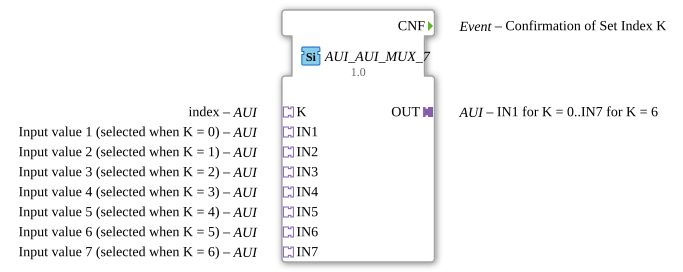

# AUI_AUI_MUX_7

* * * * * * * * * *

## Introduction

The **AUI_AUI_MUX_7** is a generic, adapter-based multiplexer function block designed to select one of seven input channels and forward its value to a single output. The selection is performed via a dedicated index adapter (`K`). The block is part of the unidirectional adapter type system and is characterized by an event-driven output update mechanism: the output adapter is only refreshed when the selected value actually changes, thereby suppressing redundant events and data transmissions.

## Interface Structure

### **Event Inputs**

The function block does not declare any explicit event inputs. Its operation is purely data-driven through the adapter sockets; changes on the selected input adapter trigger the internal processing and subsequent output update.

### **Event Outputs**

| Name | Type | Comment |
|------|------|---------|
| `CNF` | Event | Confirmation of Set Index K |

The `CNF` event is emitted whenever a new index value is applied via the `K` adapter, confirming that the selection has been processed.

### **Data Inputs**

The block does not expose any direct data inputs. All input data is carried through the adapter sockets listed below.

### **Data Outputs**

The block does not expose any direct data outputs. All output data is carried through the adapter plug `OUT`.

### **Adapters**

**Plugs (Outputs):**

| Name | Type | Comment |
|------|------|---------|
| `OUT` | `adapter::types::unidirectional::AUI` | Selected input value; IN1 for K=0 … IN7 for K=6 |

**Sockets (Inputs):**

| Name | Type | Comment |
|------|------|---------|
| `K` | `adapter::types::unidirectional::AUI` | Index; selects one of the 7 input channels (0…6) |
| `IN1` | `adapter::types::unidirectional::AUI` | Input value 1 (selected when K = 0) |
| `IN2` | `adapter::types::unidirectional::AUI` | Input value 2 (selected when K = 1) |
| `IN3` | `adapter::types::unidirectional::AUI` | Input value 3 (selected when K = 2) |
| `IN4` | `adapter::types::unidirectional::AUI` | Input value 4 (selected when K = 3) |
| `IN5` | `adapter::types::unidirectional::AUI` | Input value 5 (selected when K = 4) |
| `IN6` | `adapter::types::unidirectional::AUI` | Input value 6 (selected when K = 5) |
| `IN7` | `adapter::types::unidirectional::AUI` | Input value 7 (selected when K = 6) |

## Functionality

The block operates as a 7-to-1 multiplexer on the AUI adapter level. The index adapter `K` determines which of the seven input adapters (`IN1` … `IN7`) is routed to the output adapter `OUT`. The mapping is straightforward:

- `K = 0` → `IN1`
- `K = 1` → `IN2`
- `K = 2` → `IN3`
- `K = 3` → `IN4`
- `K = 4` → `IN5`
- `K = 5` → `IN6`
- `K = 6` → `IN7`

The output is **not** updated on every input change. Instead, the output adapter is refreshed only when the value of the currently selected input channel deviates from the previously forwarded value. If the selected input value remains unchanged, no output update is performed and no event is generated. This behavior minimizes unnecessary data traffic on the output adapter connection.

## Technical Features

- **Generic FB Implementation:** The block is defined as a generic type (`GEN_AUI_AUI_MUX`) and instantiated for the 7-input variant.
- **Unidirectional Adapter Interface:** All adapters (input and output) use the `adapter::types::unidirectional::AUI` type, ensuring a one-way data flow.
- **Event-Driven Output Update:** Output refresh occurs solely on actual value change, reducing communication overhead.
- **Confirmation Event:** The `CNF` event provides explicit feedback that a new index has been applied.
- **No Direct Data I/O:** All data exchange is encapsulated within the adapter interface, promoting modular and reusable design.

## State Overview

The block does not exhibit a complex state machine. Its behavior can be described as:

1. **Idle / Monitoring State:** The block monitors the index adapter `K` and the selected input channel.
2. **Change Detection State:** When the index changes or the value of the selected input changes, the block compares the new value with the previously forwarded value.
3. **Update State:** If the new value differs from the previous output value, the output adapter is updated and the `CNF` event is issued. If the value is identical, no action is taken.

## Application Scenarios

- **Sensor Selection:** Selecting between multiple sensors or measurement sources connected via AUI adapters, forwarding only the active channel's data.
- **Data Source Routing:** Routing data from multiple production lines or machines to a single monitoring or control interface.
- **Mode Switching:** Switching between different operational parameter sets (e.g., configuration profiles) in an IEC 61499-based automation system.
- **Reducing Bus Load:** In distributed systems, using the change-detection mechanism to avoid unnecessary network traffic when values remain stable.

## Comparison with Similar Blocks

| Feature | AUI_AUI_MUX_7 | Typical data MUX (ANSI/IEC) |
|---------|---------------|------------------------------|
| Interface | Adapter-based (AUI) | Direct data pins |
| Number of inputs | 7 | Typically 2, 4, 8 (binary select) |
| Selection | Via adapter `K` | Via binary select lines |
| Output update | Only on value change | Always on new input/select |
| Confirmation event | Yes (`CNF`) | Usually none |
| Generic instantiation | Yes (`GEN_AUI_AUI_MUX`) | Usually fixed type |

Compared to conventional data multiplexers, this block offers a cleaner adapter abstraction, supports a larger number of inputs, and incorporates an event-based change detection that can significantly reduce communication and processing overhead in event-driven 4diac applications.

## Conclusion

The **AUI_AUI_MUX_7** provides a robust and efficient solution for adapter-level multiplexing in IEC 61499 environments. Its key strengths lie in the unidirectional adapter interface, the generic instantiation pattern, and the intelligent change-detection mechanism that only updates the output when actual value differences occur. This makes it particularly suitable for distributed automation scenarios where bandwidth and processing efficiency are critical, while the `CNF` event ensures deterministic feedback on selection changes.
