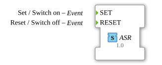

# ASR (EVENT)

**Plug (adapter output)**

**Socket (adapter input)**

unidirectional adapter interface for 2 events

## Interface

### Events

| Name  | Comment          | With |
| :---- | :--------------- | :--- |
| SET   | Set/Switch on    |      |
| RESET | Reset/Switch off |      |
