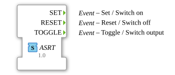
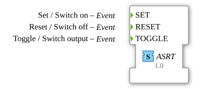

# ASRT (EVENT)

**Plug (adapter output)**

**Socket (adapter input)**

unidirectional adapter interface for 3 events

## Interface

### Events

| Name   | Comment                | With |
| :----- | :--------------------- | :--- |
| SET    | Set / Switch on        |      |
| RESET  | Reset / Switch off     |      |
| TOGGLE | Toggle / Switch output |      |
