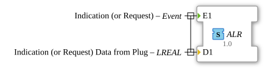

# ALR (LREAL)

**Plug (adapter output)**

**Socket (adapter input)**

unidirectional Adapter Interface for 1 Event and 1 Lreal

## Interface

### Events

| Name | Comment                 | With |
| :--- | :---------------------- | :--- |
| E1   | Indication (or Request) | D1   |

### Data

| Name | Type  | Comment                                |
| :--- | :---- | :------------------------------------- |
| D1   | LREAL | Indication (or Request) Data from Plug |
