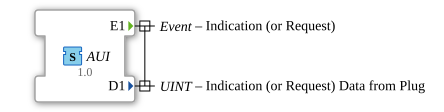

# AUI (UINT)

**Plug (adapter output)**

**Socket (adapter input)**

unidirectional Adapter Interface for 1 Event and 1 Uint

## Interface

### Events

| Name | Comment                 | With |
| :--- | :---------------------- | :--- |
| E1   | Indication (or Request) | D1   |

### Data

| Name | Type | Comment                                |
| :--- | :--- | :------------------------------------- |
| D1   | UINT | Indication (or Request) Data from Plug |
