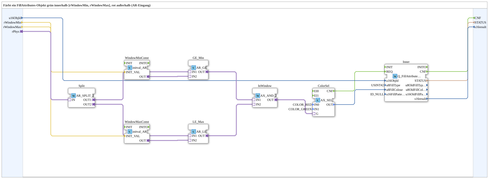

# FillWindowFS_AR

* * * * * * * * * *

## Introduction

The **FillWindowFS_AR** subapplication is a reusable IEC 61499 composite function block designed to colorize a FillAttributes object based on the position of a physical value relative to a configurable window. It accepts a real-valued input through an AR adapter, evaluates whether this value falls within the interval `[rWindowMin, rWindowMax]`, and then commands an internal `Q_FillAttributes` function block to apply either green (inside the window) or red (outside the window) to the specified visualization object. This subapp encapsulates the complete evaluation and coloring logic into a single, network-embeddable component.

## Interface Structure

The subapplication exposes a minimal and clearly defined interface, comprising one event output, three data inputs, two data outputs, and one adapter socket.

### **Event Inputs**

This subapplication does not provide a dedicated event input. The internal service sequence is triggered autonomously via the adapter connection chain; however, the confirmation path is exposed externally.

### **Event Outputs**

| Name | Type | Comment |
|------|------|---------|
| CNF | Event | Confirmation of the requested service, passed through from the internal `Q_FillAttributes` block upon completion. |

### **Data Inputs**

| Name | Type | Initial Value | Comment |
|------|------|---------------|---------|
| u16ObjId | UINT | ID_NULL | FillAttributes object ID to command. Identifies the visualization object whose color shall be set. |
| rWindowMin | REAL | — | Lower bound of the window that shows green. Values equal to or greater than this bound are considered inside the window. |
| rWindowMax | REAL | — | Upper bound of the window that shows green. Values equal to or less than this bound are considered inside the window. |

### **Data Outputs**

| Name | Type | Comment |
|------|------|---------|
| STATUS | STRING | Service status — passthrough from the internal `Q_FillAttributes` block, providing textual feedback about the last operation. |
| s16result | INT | Return value — passthrough from the internal `Q_FillAttributes` block, providing a numeric result code. |

### **Adapters**

| Name | Type | Direction | Comment |
|------|------|-----------|---------|
| rPhys | adapter::types::unidirectional::AR | Socket | Physical value whose position relative to the window determines the applied color. The incoming AR adapter carries a real number that is evaluated against the configured bounds. |

## Functionality

The subapplication implements a classic threshold-window evaluation combined with a two-color selection scheme. The functional flow proceeds as follows:

1. **Signal Fan-Out** — The incoming AR adapter `rPhys` is connected to a `AR_SPLIT_2` block (named `Split`), which duplicates the physical value into two identical output streams. This allows the same value to be compared independently against both the minimum and maximum bounds.

2. **Window Initialization** — Two `initval_AR` constant blocks (`WindowMinConst` and `WindowMaxConst`) are initialized with the externally provided `rWindowMin` and `rWindowMax` values, making them available as constant AR outputs for the downstream comparisons.

3. **Boundary Comparisons** — The first duplicated value is passed to an `AR_GE` block (named `GE_Min`), which checks whether the physical value is greater than or equal to `rWindowMin`. The second duplicated value is passed to an `AR_LE` block (named `LE_Max`), which checks whether the physical value is less than or equal to `rWindowMax`.

4. **Logical AND** — The boolean outputs of both comparison blocks feed into an `AX_AND_2` block (named `InWindow`). The output is `TRUE` only when both conditions hold, i.e., when the physical value lies within the closed interval `[rWindowMin, rWindowMax]`.

5. **Color Selection** — The boolean result drives a `AX_SEL` block (named `ColorSel`). The selection block has its `IN0` parameter fixed to `COLOR_RED` and `IN1` fixed to `COLOR_GREEN`. When the `InWindow` signal is `TRUE`, green is selected; otherwise, red is selected. The chosen color is passed as the `OUT` value.

6. **Fill Command** — The color output from `ColorSel` is routed to the `u8FillColour` input of the internal `Q_FillAttributes` block (named `Inner`). Simultaneously, the external `u16ObjId` is connected to the block's object ID input. The block is parameterized with `u8FillType = USINT#2` (solid fill) and `u16FillPatternId = ID_NULL`.

7. **Event Handshaking** — The `ColorSel.CNF` event triggers the `Inner.REQ` event, initiating the fill operation. Upon completion, the internal block's `CNF` event is propagated to the subapplication's external `CNF` output.

8. **Result Propagation** — Both `STATUS` and `s16result` from the internal `Q_FillAttributes` block are forwarded directly to the subapplication's corresponding output ports, providing full transparency about the operation's outcome.

## Technical Features

- **Composite SubApplication Type** — Implemented as a `SubAppType` rather than a custom FBType, allowing easy reuse and modification through standard 4diac-IDE tooling.
- **Adapter-Based Input** — The physical value is acquired via a unidirectional AR adapter, decoupling the subapp from specific sensor or data source implementations and promoting type-safe connections.
- **Constant Initialization Pattern** — Utilizes `initval_AR` blocks to convert runtime REAL variables into adapter-based constant values, leveraging the adapter framework's type system.
- **Comparison Logic** — Closed interval evaluation using `AR_GE` and `AR_LE`, guaranteeing that boundary values are treated as inside the window.
- **Color Mapping** — Pre-configured `AX_SEL` parameters with `COLOR_RED` and `COLOR_GREEN` constants, drawing from the `isobus::UT::Q::const::colours` namespace.
- **Event Propagation Chain** — A clean event cascade from selection confirmation to fill request, then back to the caller via the `CNF` output.
- **Status Passthrough** — Both status string and result integer are exposed at the subapp boundary, enabling callers to monitor and log operations without inspecting internal state.
- **Namespace Imports** — Explicit imports of `Q_FillAttributes`, `ID_NULL`, and color constants ensure compile-time correctness in the target runtime environment.

## State Overview

As a purely combinational subapplication built from data-flow oriented blocks, `FillWindowFS_AR` does not maintain an internal state machine. However, the underlying `Q_FillAttributes` block may possess internal states related to service execution. The observable behavior per service cycle can be summarized as:

| Condition | Evaluation Result | Selected Color | Fill Command |
|-----------|-------------------|----------------|--------------|
| `rPhys < rWindowMin` | Outside (below) | RED | Solid red fill |
| `rWindowMin ≤ rPhys ≤ rWindowMax` | Inside window | GREEN | Solid green fill |
| `rPhys > rWindowMax` | Outside (above) | RED | Solid red fill |

The absence of internal state simplifies testing and makes the block's behavior fully deterministic for a given set of inputs.

## Application Scenarios

- **Visualization of Process Variables** — In a process control HMI, the subapp can color-code a numeric indicator (e.g., temperature, pressure, level) green when it lies within an acceptable operating range and red when it deviates, providing immediate visual feedback to operators.
- **Alarm and Limit Monitoring** — When integrated with alarm handling logic, the subapp can be used to repaint warning icons or trend markers based on whether a measured value violates configured thresholds.
- **Quality Control and Sorting** — In manufacturing or inspection systems, the block can visually flag measured dimensions or test results that fall outside tolerance windows.
- **Interactive Panels and Dashboards** — The subapp can drive color changes on dashboard widgets where a physical quantity's range (e.g., speed, fuel level, temperature) determines the displayed color.
- **Educational Demonstrations** — As a clearly structured composite, it serves as a learning example for adapter-based data flow, window comparisons, and event-driven service invocation in IEC 61499 systems.

## Comparison with Similar Blocks

| Feature | FillWindowFS_AR | Custom FBType with ST Helper | GreenRedBackground1_AX |
|---------|----------------|------------------------------|------------------------|
| Implementation | SubAppType composite | Custom compiled FBType | Similar SubApp approach |
| Input Paradigm | AR adapter for physical value | Direct data inputs | AR adapter |
| Window Evaluation | Internal GE/LE + AND logic | Inline ST condition | Configurable via parameters |
| Color Constants | Fixed RED/GREEN | Depends on implementation | Fixed RED/GREEN |
| Event Output | Single CNF | Depends on design | Single CNF |
| Reconfigurability | High (network editable) | Medium (code changes) | High |
| Runtime Dependencies | Only standard adapter FBs | Custom compiled code | Standard adapter FBs |

Compared to a hand-coded FBType with ST logic, this subapp leverages standard building blocks, making it more transparent, portable, and inspectable at the network level. Relative to similar background-coloring subapps, it adds the window-based comparison and the physical-value adapter input in an integrated form.

## Conclusion

The **FillWindowFS_AR** subapplication provides a compact, well-structured, and reusable solution for range-based color visualization of physical values on FillAttributes objects. By combining standard comparison blocks, an AND gate, a selection block, and a `Q_FillAttributes` service block, it implements a complete green-inside / red-outside logic with minimal external wiring. The clear interface, event passthrough, and status propagation make it straightforward to integrate into larger IEC 61499 applications, while the adapter-based input ensures compatibility with a wide range of sensor and data sources. It is a practical building block for HMI development, alarm visualization, and quality-related color-coding tasks in industrial automation environments.
