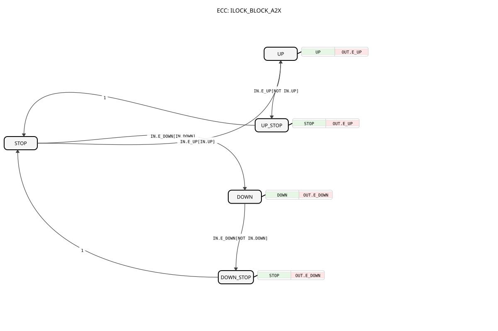

# ILOCK_BLOCK_A2X

* * * * * * * * * *

## Introduction

The **ILOCK_BLOCK_A2X** is a basic function block (FB) that implements an interlock mechanism for directional commands (UP/DOWN) over a unidirectional A2X adapter. It prioritizes the *first* active input event and latches that direction until the corresponding input signal is withdrawn, ensuring that only one output direction can be active at a time. This makes it suitable for safety-related control of actuators such as hoists, sliding gates, or lifting platforms.

## Interface Structure

The FB communicates exclusively through a single adapter pair of type `adapter::types::unidirectional::A2X`. The input socket `IN` receives events and data from the environment, while the output plug `OUT` forwards the latched state and corresponding event triggers.

### **Event Inputs**

The events are carried by the input adapter `IN` and carry the data elements `UP` and `DOWN` as qualifiers (per IEC 61499 WITH semantics).

| Event     | Associated Data | Description                                      |
|-----------|-----------------|--------------------------------------------------|
| `IN.E_UP`   | `IN.UP`         | Request/trigger for the UP direction.            |
| `IN.E_DOWN` | `IN.DOWN`       | Request/trigger for the DOWN direction.          |

### **Event Outputs**

The events are emitted on the output plug `OUT` together with the corresponding state data.

| Event      | Associated Data | Description                                        |
|------------|-----------------|----------------------------------------------------|
| `OUT.E_UP`   | `OUT.UP`, `OUT.DOWN` | Acknowledges the UP state or the UP release. |
| `OUT.E_DOWN` | `OUT.UP`, `OUT.DOWN` | Acknowledges the DOWN state or the DOWN release. |

### **Data Inputs**

The input data are accessed through the input socket `IN` and are only valid when the respective event is present.

| Data     | Type    | Description                                        |
|----------|---------|----------------------------------------------------|
| `IN.UP`    | BOOL | Level signal requesting the UP direction.        |
| `IN.DOWN`  | BOOL | Level signal requesting the DOWN direction.      |

### **Data Outputs**

The output data are provided on the output plug `OUT` and reflect the currently latched direction.

| Data      | Type    | Description                                        |
|-----------|---------|----------------------------------------------------|
| `OUT.UP`    | BOOL | `TRUE` while the UP direction is latched.        |
| `OUT.DOWN`  | BOOL | `TRUE` while the DOWN direction is latched.      |

### **Adapters**

| Adapter | Direction | Type                                   | Description                                     |
|---------|-----------|----------------------------------------|-------------------------------------------------|
| `IN`      | Socket    | `adapter::types::unidirectional::A2X` | Receives UP/DOWN commands and events.         |
| `OUT`     | Plug      | `adapter::types::unidirectional::A2X` | Sends the latched direction and events.        |

## Functionality

The FB is implemented as a basic FB with an ECC (Execution Control Chart). It operates in a purely event-driven manner:

1. **From STOP state**
   - If `IN.E_UP` occurs and `IN.UP` is `TRUE`, the FB transitions to the `UP` state, sets `OUT.UP := TRUE` / `OUT.DOWN := FALSE` and emits `OUT.E_UP`.
   - If `IN.E_DOWN` occurs and `IN.DOWN` is `TRUE`, the FB transitions to the `DOWN` state, sets `OUT.UP := FALSE` / `OUT.DOWN := TRUE` and emits `OUT.E_DOWN`.

2. **In UP state**
   - The FB ignores any DOWN commands. If `IN.E_UP` occurs again while `IN.UP` is `FALSE` (the requesting signal has been released), it transitions to `UP_STOP`, resets both outputs to `FALSE` and emits `OUT.E_UP` to signal the release.

3. **In DOWN state**
   - Symmetrically, if `IN.E_DOWN` occurs while `IN.DOWN` is `FALSE`, the FB transitions to `DOWN_STOP`, resets both outputs to `FALSE` and emits `OUT.E_DOWN`.

4. **Stop handshake**
   - `UP_STOP` and `DOWN_STOP` are transient states; the FB immediately returns to `STOP` (unconditional transition), ready for the next command.

This behaviour ensures that the first active input (UP or DOWN) is prioritised and kept latched until it is explicitly withdrawn. The outputs `OUT.UP` / `OUT.DOWN` are never `TRUE` simultaneously, satisfying an interlock requirement.

## Technical Features

- **IEC 61499-2 compliant** basic FB with ECC formalism.
- **Adapter-based interface** – uses the unidirectional `A2X` adapter type for both input and output, allowing direct connection to a partner FB via a single plug/socket pair.
- **Structured Text (ST)** algorithms for state actions.
- **Event-qualified data** – input data are sampled together with their associated event, avoiding glitches on the input line.
- **Deterministic state machine** – five ECC states (`STOP`, `UP`, `DOWN`, `UP_STOP`, `DOWN_STOP`) ensure reproducible behaviour.
- **Latched output** – the output direction is held until an explicit release event is received.
- **EPL-2.0 licensed** – can be freely used and modified in 4diac-based projects.

## State Overview

| State       | Description                                                                                     | Actions / Outputs                              |
|-------------|-------------------------------------------------------------------------------------------------|-----------------------------------------------|
| `STOP`        | Idle state, no direction latched.                                                               | none                                          |
| `UP`          | UP direction is latched and active.                                                             | `OUT.UP := TRUE`, `OUT.DOWN := FALSE`, emit `OUT.E_UP` |
| `DOWN`        | DOWN direction is latched and active.                                                           | `OUT.UP := FALSE`, `OUT.DOWN := TRUE`, emit `OUT.E_DOWN` |
| `UP_STOP`     | UP direction is being released; both outputs reset.                                             | `OUT.UP := FALSE`, `OUT.DOWN := FALSE`, emit `OUT.E_UP` |
| `DOWN_STOP`   | DOWN direction is being released; both outputs reset.                                           | `OUT.UP := FALSE`, `OUT.DOWN := FALSE`, emit `OUT.E_DOWN` |

Transitions:

- `STOP` → `UP` : `IN.E_UP[IN.UP]`
- `STOP` → `DOWN` : `IN.E_DOWN[IN.DOWN]`
- `UP` → `UP_STOP` : `IN.E_UP[NOT IN.UP]`
- `DOWN` → `DOWN_STOP` : `IN.E_DOWN[NOT IN.DOWN]`
- `UP_STOP` → `STOP` : unconditional
- `DOWN_STOP` → `STOP` : unconditional

## Application Scenarios

- **Actuator control** – controlling a single motor with forward/reverse (UP/DOWN) commands, e.g., roller shutters, conveyors, adjustable tables.
- **Interlocking in safety circuits** – preventing simultaneous activation of two contradictory commands (e.g., raise/lower) in manual control panels.
- **First-command priority logic** – when both directions are possible but only the first activated direction should be executed until it is released.
- **Adapter-chained signal chains** – because the FB uses unidirectional A2X adapters, it can be easily chained with other adapter-based logic blocks in a modular 4diac application.

## Comparison with Similar Blocks

| Feature                        | ILOCK_BLOCK_A2X                            | Classic SR Latch (RS-FF)          | Plain A2X pass-through             |
|--------------------------------|--------------------------------------------|-----------------------------------|------------------------------------|
| Interface                      | A2X adapter (event + level)                | Separate BOOL inputs              | A2X adapter                        |
| Priority handling              | First active input is latched              | Set overrides Reset (or vice versa)| None (direct forwarding)           |
| Direction exclusivity          | Guaranteed (never both outputs `TRUE`)     | Not guaranteed (can be both)      | Not guaranteed                     |
| Release acknowledgement        | Explicit event on stop (`E_UP` / `E_DOWN`) | None                              | None                               |
| Use in event-driven environment| Fully integrated (events with data)        | Level-based, no events            | Events forwarded, no latched state |

## Conclusion

The **ILOCK_BLOCK_A2X** is a robust, event-driven interlock component that elegantly enforces first-input priority and exclusive output direction. Its adapter-based design makes it highly reusable and easy to connect within IEC 61499 systems, while the explicit stop events provide clean handshaking with downstream logic. It is well suited for any application where conflicting directional commands must be safely serialised.
