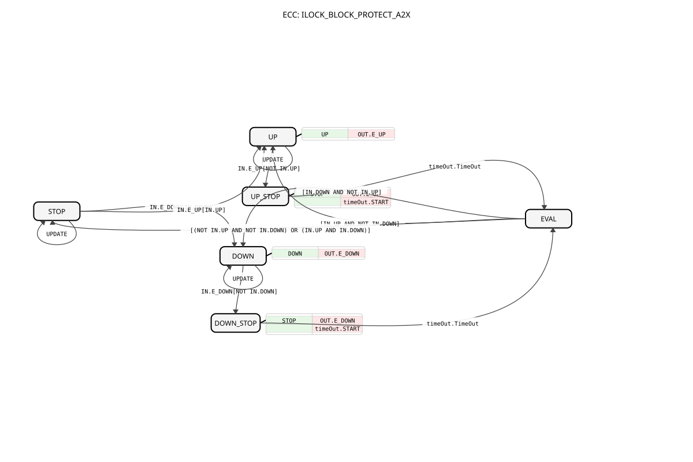

# ILOCK_BLOCK_PROTECT_A2X

* * * * * * * * * *

## Introduction

The ILOCK_BLOCK_PROTECT_A2X function block implements an interlock mechanism for UP/DOWN control signals with a configurable protection dead-time. It prioritizes the first active input and suppresses conflicting commands during the protection interval, preventing rapid switching and potential mechanical or logical damage.

This block is an adapter-based version using the A2X type for unidirectional UP/DOWN signals, and a timer adapter for dead-time handling.

## Interface Structure

### **Event Inputs**

- **UPDATE** (Event) – Triggers an update of the protection time parameter (DT_PROTECT). While in any state, an UPDATE event causes the block to refresh its internal parameter without altering the current output state.

### **Event Outputs**

None. The block does not produce direct event outputs. All state changes are reflected through the adapter outputs.

### **Data Inputs**

- **DT_PROTECT** (TIME) – Protection dead-time. Default: T#50ms. This value defines the minimum time during which the output state is held after a change, ignoring conflicting input changes.

### **Data Outputs**

None directly. Output data is provided via the OUT adapter.

### **Adapters**

- **OUT** (Plug, type `adapter::types::unidirectional::A2X`) – Output adapter carrying the UP and DOWN boolean signals to the controlled device.
- **timeOut** (Plug, type `iec61499::events::ATimeOut`) – Timer adapter used to measure the protection dead-time. It receives the DT value and emits a TimeOut event when the interval expires.
- **IN** (Socket, type `adapter::types::unidirectional::A2X`) – Input adapter receiving the UP and DOWN commands from the source.

## Functionality

The block acts as a priority interlock with dead-time protection:

1. **Idle (STOP)** – No active output. When either UP or DOWN becomes active (and the other is inactive), the block transitions to the corresponding active state (UP or DOWN) and sets the appropriate output.
2. **Active (UP or DOWN)** – The corresponding output is set. If the active input is released (goes FALSE) or the opposite input becomes active, the block enters a stop phase (UP_STOP or DOWN_STOP) while keeping the current output signal active for the protection time.
3. **Stop Phase (UP_STOP or DOWN_STOP)** – The output is cleared, but the timer is started. After the dead-time expires, the block evaluates the input conditions and moves to:
   - UP if only UP is active,
   - DOWN if only DOWN is active,
   - STOP if both are inactive or both active.
4. **Evaluation (EVAL)** – This state occurs after the dead-time and decides the next state based on the inputs.

The priority rule is: if both UP and DOWN are simultaneously active, the block goes to STOP (no output). If only one is active, that direction is selected. If none, it stays STOP.

The dead-time ensures that after a change, any subsequent changes within the protection time are ignored, preventing rapid toggling.

## Technical Features

- Adapter-based design using A2X for propagation of UP/DOWN signals.
- Configurable dead-time via DT_PROTECT input.
- Handles input changes gracefully with a timer-based state machine.
- Supports runtime parameter updates via the UPDATE event.
- Meets IEC 61499 standard for function blocks.

## State Overview

The block has six states:

- **STOP**: No outputs active. Waits for valid UP/DOWN command.
- **UP**: UP output active, DOWN inactive.
- **DOWN**: DOWN output active, UP inactive.
- **UP_STOP**: Entered when UP input goes inactive or DOWN becomes active while in UP. Output is cleared and timer starts.
- **DOWN_STOP**: Entered when DOWN input goes inactive or UP becomes active while in DOWN. Output is cleared and timer starts.
- **EVAL**: After timer expiry, evaluates inputs to determine next state.

Transitions are based on input events (IN.E_UP, IN.E_DOWN) combined with the boolean values (IN.UP, IN.DOWN) and the timer TimeOut event.

## Application Scenarios

This block is suitable for:

- Controlling bidirectional drives (e.g., motors, actuators) where conflicting commands must be avoided.
- Systems requiring a minimum dwell time between direction changes to protect mechanical components.
- Applications using adapter-based communication (A2X) in IEC 61499 distributed control systems.

## Comparison with Similar Blocks

Compared to a simple interlock block without dead-time, this block adds a protection period to prevent rapid switching. The use of the A2X adapter allows easier integration with other A2X-compatible components, and the timer adapter makes the dead-time configurable. It is more robust than a direct logic block because it incorporates time-based state management.

## Conclusion

The ILOCK_BLOCK_PROTECT_A2X provides a reliable interlock solution with adjustable dead-time, leveraging adapter-based communication in IEC 61499. Its state machine ensures safe operation by prioritizing the first active input and suppressing conflicting commands during the protection interval.