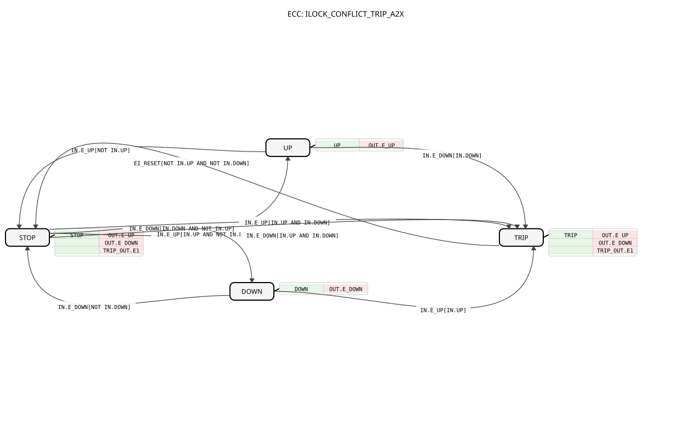

# ILOCK_CONFLICT_TRIP_A2X

* * * * * * * * * *

## Introduction

The **ILOCK_CONFLICT_TRIP_A2X** function block implements an interlock mechanism for control applications requiring a safe handling of conflicting directional commands. It accepts two mutually exclusive direction signals (e.g., forward/up and backward/down) via a single bidirectional adapter and ensures that only one direction is ever active at a time. If both commands are present simultaneously, the block enters a **trip** state, setting a dedicated alarm output. Recovery from the trip state requires an explicit reset event, but only after both conflicting inputs have been released.

## Interface Structure

The block communicates exclusively through adapter instances. There are no dedicated event or data ports other than the reset event input.

### **Event Inputs**

| Event    | Description                                |
|----------|--------------------------------------------|
| `EI_RESET` | Clears the trip state when the conflict is resolved (i.e., both `IN.UP` and `IN.DOWN` are `FALSE`). |

### **Event Outputs**

There are no direct event output ports. All event-driven signalling is performed via the adapter outputs (`OUT.E_UP`, `OUT.E_DOWN`, `TRIP_OUT.E1`).

### **Data Inputs**

There are no standalone data inputs. All data is read from the `IN` adapter (see below).

### **Data Outputs**

There are no standalone data outputs. All data values are written to the `OUT` and `TRIP_OUT` adapters.

### **Adapters**

| Adapter     | Type                              | Description                                                                 |
|-------------|-----------------------------------|-----------------------------------------------------------------------------|
| `IN`        | `adapter::types::unidirectional::A2X` | Receives the directional commands. Carries the events `E_UP`, `E_DOWN` and the data signals `UP`, `DOWN`. |
| `OUT`       | `adapter::types::unidirectional::A2X` | Mirrors the currently active and safe direction. Provides the events `E_UP`, `E_DOWN` and data `UP`, `DOWN`. |
| `TRIP_OUT`  | `adapter::types::unidirectional::AX`  | Outputs the trip status. Contains the event `E1` and data `D1` (trip indication, `TRUE` when tripped). |

## Functionality

The block operates as a state machine with four states: `STOP`, `UP`, `DOWN`, and `TRIP`. Its core logic is as follows:

- **STOP**: No direction is active. The block waits for a valid event on the `IN` adapter.
- **UP / DOWN**: A single direction is active. The corresponding output data and event are sent.
- **TRIP**: A conflict has been detected. The block deactivates both directions, sets `TRIP_OUT.D1` to `TRUE`, and emits the trip event. It remains in this state until an `EI_RESET` event occurs while both `IN.UP` and `IN.DOWN` are `FALSE`.

The block prioritises the first active input: if only one of the two inputs is active, the block moves to the corresponding state. If both inputs become active simultaneously (or while a direction is already active and the other input arrives), the block immediately trips. This ensures that opposing commands can never be forwarded to the actuator.

## Technical Features

- **State machine based on IEC 61499 ECC** – implemented as a basic function block.
- **Adapter-based I/O** – uses unidirectional adapters to separate input and output paths.
- **Conflict detection** – immediately reacts to simultaneous `UP` and `DOWN` signals.
- **Reset safety** – the trip state can only be cleared when the conflict has been fully removed (both inputs `FALSE`).
- **Event synchronisation** – transitions are triggered by events on the `IN` adapter, ensuring deterministic behaviour.

## State Overview

| State   | Description                                                                 | Transition Conditions                                                              |
|---------|-----------------------------------------------------------------------------|------------------------------------------------------------------------------------|
| `STOP`  | No direction active, all outputs `FALSE`.                                   | → `UP` on `IN.E_UP` if `IN.UP` and NOT `IN.DOWN`; → `DOWN` on `IN.E_DOWN` if `IN.DOWN` and NOT `IN.UP`; → `TRIP` on either event if both `IN.UP` and `IN.DOWN` are `TRUE`. |
| `UP`    | Forward/up direction active.                                                | → `STOP` on `IN.E_UP` if NOT `IN.UP`; → `TRIP` on `IN.E_DOWN` if `IN.DOWN`.      |
| `DOWN`  | Backward/down direction active.                                             | → `STOP` on `IN.E_DOWN` if NOT `IN.DOWN`; → `TRIP` on `IN.E_UP` if `IN.UP`.      |
| `TRIP`  | Conflict detected, both directions deactivated, `TRIP_OUT.D1` set to `TRUE`. | → `STOP` on `EI_RESET` if NOT `IN.UP` and NOT `IN.DOWN`.                            |

## Application Scenarios

This block is well suited for safety-critical interlocking in machinery, conveyor systems, or any application where two opposing actuation commands must never be delivered simultaneously. Typical use cases include:

- Hoist or crane direction control.
- Hydraulic or pneumatic cylinder extension/retraction with safety interlocks.
- Motor control with forward/reverse operation and anti-conflict logic.
- Any system requiring a “trip” (fault) condition when conflicting commands are issued.

## Comparison with Similar Blocks

Compared to a simple interlock that merely prioritises one input, the `ILOCK_CONFLICT_TRIP_A2X` adds an explicit trip state to signal a hardware or software conflict. This makes it more suitable for systems that require a visible alarm and a manual or logical reset after a fault. Unlike a pure priority encoder, it does not silently ignore the secondary input – it reacts to the conflict and forces the system into a safe state. The adapter-based design also simplifies integration with other 4diac components using the same adapter types.

## Conclusion

The `ILOCK_CONFLICT_TRIP_A2X` function block provides a robust and safe interlocking solution for directional commands. Its clear state machine, conflict detection, and trip/reset behaviour make it a valuable component for automation projects that demand high reliability and fail-safe operation. By using standard adapters, it can be easily connected to existing I/O infrastructure and integrated into larger control applications.