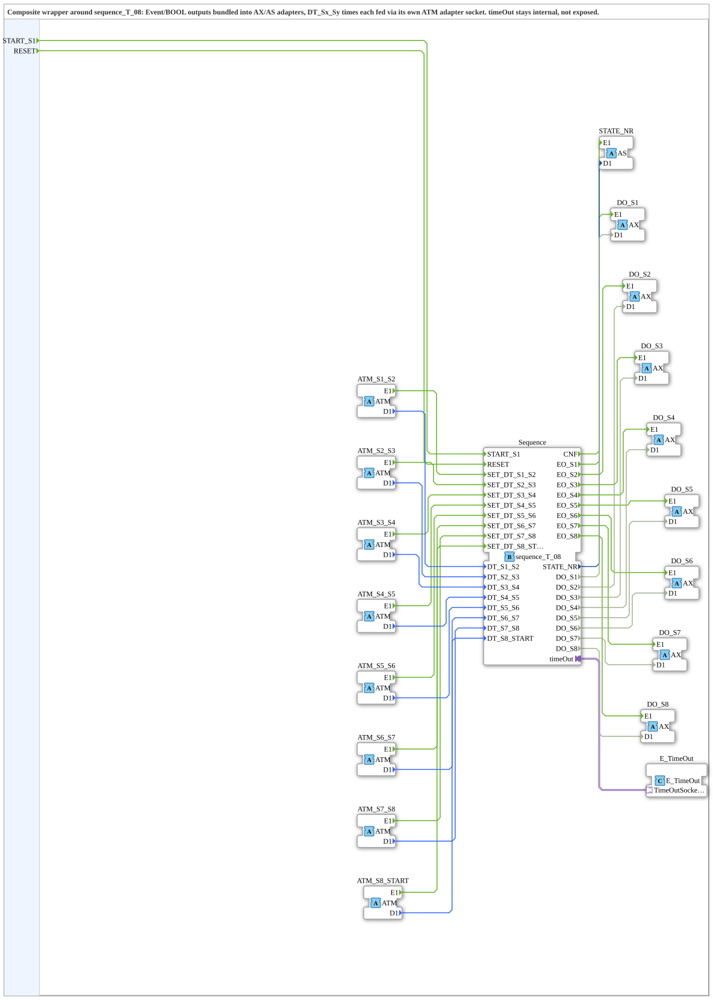

# sequence_T_08_ADAPTER

* * * * * * * * * *

## Introduction

`sequence_T_08_ADAPTER` is a composite wrapper around [sequence_T_08](sequence_T_08.md): the same generic time-controlled 8-step sequencer, but with every output and transition time moved onto adapter connections. Unlike [sequence_T_08_AX](sequence_T_08_AX.md), which only moves the eight outputs onto `AX` adapters, `sequence_T_08_ADAPTER` additionally bundles the state number (`AS`) and feeds each of the eight transition times through its own `ATM` adapter socket.

## Function Blocks Used (FBs)

### Sub-modules: sequence_T_08_ADAPTER

- **Type**: Composite (FBNetwork)
- **Internal FBs used**:
    - **Sequence**: `logiBUS::utils::sequence::timed::sequence_T_08` - the generic 8-step time sequencer, see [sequence_T_08](sequence_T_08.md).
    - **E_TimeOut**: `iec61499::events::E_TimeOut` - standard TimeOut adapter for the internal timing; unlike `AnlagenSequenz_06_ADAPTER`, a single standard FB is enough here, no separate `TimeTicker` needed.
- **Functionality**: `DO_S1`..`DO_S8` (per-state outputs) and `STATE_NR` (current state number) run through `AX`/`AS` adapters respectively; each of the eight transition times `DT_S1_S2`..`DT_S8_START` is fed through its own `ATM` adapter socket (`ATM_S1_S2`..`ATM_S8_START`) instead of an individual `TIME` data input.

## Program Flow and Connections

1. `START_S1`/`RESET` pass through unchanged to `Sequence.START_S1`/`Sequence.RESET`.
2. Each `ATM_Sx_Sy` adapter delivers its time (`.D1`) to `Sequence.DT_Sx_Sy` and simultaneously (`.E1`) triggers the matching `Sequence.SET_DT_Sx_Sy` set event.
3. `Sequence.CNF` triggers `STATE_NR.E1`, with the current state number carried via `STATE_NR.D1`.
4. Each `Sequence.EO_Sx` triggers `DO_Sx.E1`, with the output value carried via `DO_Sx.D1`.
5. `Sequence.timeOut` (adapter socket) is connected internally to `E_TimeOut.TimeOutSocket` - the timing stays fully encapsulated inside the composite, unlike `sequence_T_08`/`sequence_T_08_AX`, which expose their own `timeOut` adapter.

## Application Scenarios

- Applications that consistently rely on adapter connections and don't want to pull individual `TIME` lines for the transition times or a separate `timeOut` adapter connection in the application.
- Reusing the generic 8-step sequencer across multiple plant sections with uniform, adapter-based wiring.

## ⚖️ Comparison with Similar Function Blocks

- **[sequence_T_08](sequence_T_08.md)**: The base variant with classic event/data/adapter connections (only `timeOut` as an adapter).
- **[sequence_T_08_AX](sequence_T_08_AX.md)**: Only moves the eight outputs onto `AX` adapters, but keeps `TIME` data inputs for the transition times and still exposes `timeOut` itself.
- **[AnlagenSequenz_06_ADAPTER](AnlagenSequenz_06_ADAPTER.md)**: Same adapter-wrapper pattern, applied to the fixed 6-motor ring topology instead of the generic 8-step sequencer.

## Conclusion

`sequence_T_08_ADAPTER` makes the generic 8-step time sequencer fully usable through adapter connections - outputs, state number, transition times, and timing all run exclusively through adapters, no individual event/data line leaves the block.

---

### 🌐 Related topic subpages on ms-muc-docs.de

- [🌐 Eclipse 4diac IDE & color reference on ms-muc-docs.de](https://www.ms-muc-docs.de/iec-61499/eclipse-4diac/)
