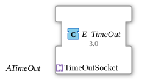

# E_TimeOut

* * * * * * * * * *

## Introduction

The **E_TimeOut** is a standards-compliant function block (IEC 61499-1) for implementing timeout services. Version 1.0 offers simple yet effective timeout functionality through internal use of an E_DELAY block. The **E_TimeOut** is a composite function block. Within the network of a composite function block, each adapter added to its interface is represented by an adapter block, which looks like a function block. The interface elements of this adapter block are connected like a function block.

## Interface Structure

### **Adapter Interface (Socket Perspective)**

The block uses a **socket** of type `ATimeOut`. Since this is a socket, the signal directions are inverted compared to the adapter definition (plug):

- **Inputs (received from the socket)**:
- `START`: Starts the internal timer.
- `STOP`: Stops the internal timer.
- `DT` (TIME): The delay time to be used.
- **Output (sent to the socket)**:
- `TimeOut`: Signaled to the connected plug after the specified time has elapsed.

### **Internal Components**

- `DLY` (E_DELAY): Core component for time control

## Functionality

1. **Timeout Initialization**:

- Upon a `START` event at the socket, the timer starts with the configured `DT` value.
- Any further `START` event while the timer is running is ignored.

1. **Timeout Termination**:

- A `STOP` event immediately terminates the active timer. No `TimeOut` event is generated.

1. **Timeout Trigger**:

- After `DT` expires, the `TimeOut` event is generated once.

## Technical Features

✔ **Adapter-based** interface (`ATimeOut`).

✔ **Simple, non-retriggerable timeout logic**.

✔ **Deterministic** timing behavior.

## Application Scenarios

- **Network Communication**: Monitoring for a response within a fixed timeframe. When the response arrives, the timer is canceled via `STOP`.
- **Device Control**: Simple watchdog functions that do not require resetting.
- **Process Monitoring**: Ensuring that a process step does not exceed a maximum duration.

## ⚖️ Comparison with E_RTimeOut

| Feature                  | E_TimeOut (this one) | E_RTimeOut     |
| ------------------------ | -------------------- | -------------- |
| Internal Block           | E_DELAY              | E_RDELAY       |
| `START` on running timer | Ignored              | Restarts timer |
| Adapter Type             | ATimeOut             | ARTimeOut      |

## 🛠️ Related exercises

- [Uebung_035](https://meisterschulen-am-ostbahnhof-munchen-docs.readthedocs.io/projects/4diac-exercises-docs-en/en/latest/Uebungen/test_B/Uebungen_doc/Uebung_035/)
- [Uebung_035a](https://meisterschulen-am-ostbahnhof-munchen-docs.readthedocs.io/projects/4diac-exercises-docs-en/en/latest/Uebungen/test_B/Uebungen_doc/Uebung_035a/)
- [Uebung_035a1_AX](https://meisterschulen-am-ostbahnhof-munchen-docs.readthedocs.io/projects/4diac-exercises-docs-en/en/latest/Uebungen/test_AX/Uebungen_doc/Uebung_035a1_AX/)
- [Uebung_035a2](https://meisterschulen-am-ostbahnhof-munchen-docs.readthedocs.io/projects/4diac-exercises-docs-en/en/latest/Uebungen/test_B/Uebungen_doc/Uebung_035a2/)
- [Uebung_035a2_AX](https://meisterschulen-am-ostbahnhof-munchen-docs.readthedocs.io/projects/4diac-exercises-docs-en/en/latest/Uebungen/test_AX/Uebungen_doc/Uebung_035a2_AX/)
- [Uebung_035a3](https://meisterschulen-am-ostbahnhof-munchen-docs.readthedocs.io/projects/4diac-exercises-docs-en/en/latest/Uebungen/test_B/Uebungen_doc/Uebung_035a3/)
- [Uebung_035a3_AX](https://meisterschulen-am-ostbahnhof-munchen-docs.readthedocs.io/projects/4diac-exercises-docs-en/en/latest/Uebungen/test_AX/Uebungen_doc/Uebung_035a3_AX/)
- [Uebung_035c](https://meisterschulen-am-ostbahnhof-munchen-docs.readthedocs.io/projects/4diac-exercises-docs-en/en/latest/Uebungen/test_B/Uebungen_doc/Uebung_035c/)
- [Exercise_036](https://meisterschulen-am-ostbahnhof-munchen-docs.readthedocs.io/projects/4diac-exercises-docs-en/en/latest/Uebungen/test_B/Uebungen_doc/Uebung_036/)
- [Exercise_037](https://meisterschulen-am-ostbahnhof-munchen-docs.readthedocs.io/projects/4diac-exercises-docs-en/en/latest/Uebungen/test_B/Uebungen_doc/Uebung_037/)
- [Exercise_038](https://meisterschulen-am-ostbahnhof-munchen-docs.readthedocs.io/projects/4diac-exercises-docs-en/en/latest/Uebungen/test_B/Uebungen_doc/Uebung_038/)
- [Exercise_038_AX](https://meisterschulen-am-ostbahnhof-munchen-docs.readthedocs.io/projects/4diac-exercises-docs-en/en/latest/Uebungen/test_AX/Uebungen_doc/Uebung_038_AX/)
- [Exercise_039](https://meisterschulen-am-ostbahnhof-munchen-docs.readthedocs.io/projects/4diac-exercises-docs-en/en/latest/Uebungen/test_B/Uebungen_doc/Uebung_039/)
- [Exercise_039a](https://meisterschulen-am-ostbahnhof-munchen-docs.readthedocs.io/projects/4diac-exercises-docs-en/en/latest/Uebungen/test_B/Uebungen_doc/Uebung_039a/)

## Conclusion

The E_TimeOut block provides a robust basic implementation for non-retriggerable timeout requirements. It is ideal for cases where a timer is started and should either run to completion or be explicitly aborted. For scenarios that require "re-triggering" or resetting the timer (such as a watchdog that is periodically "kicked"), the `E_RTimeOut` block is the better choice.
